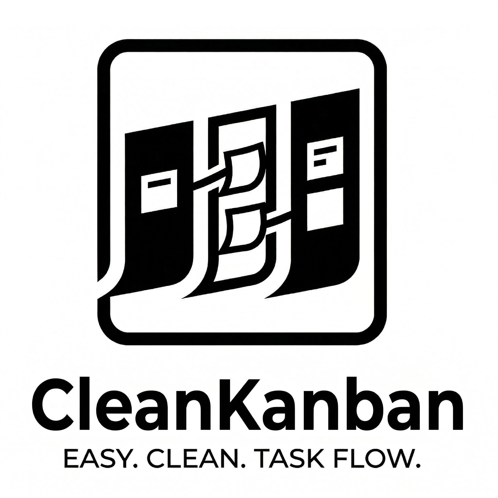
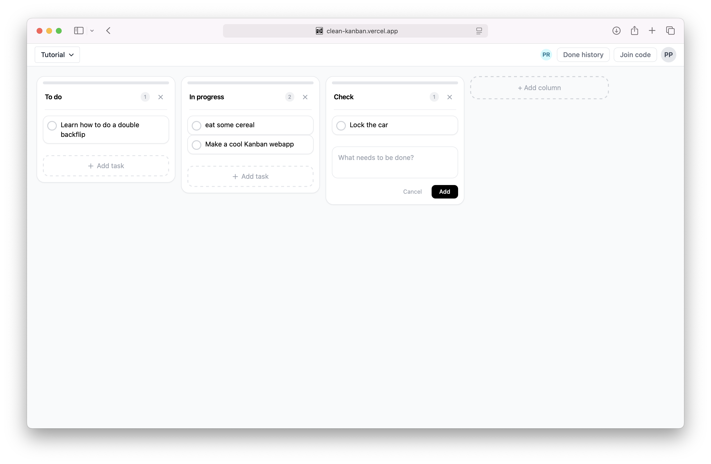
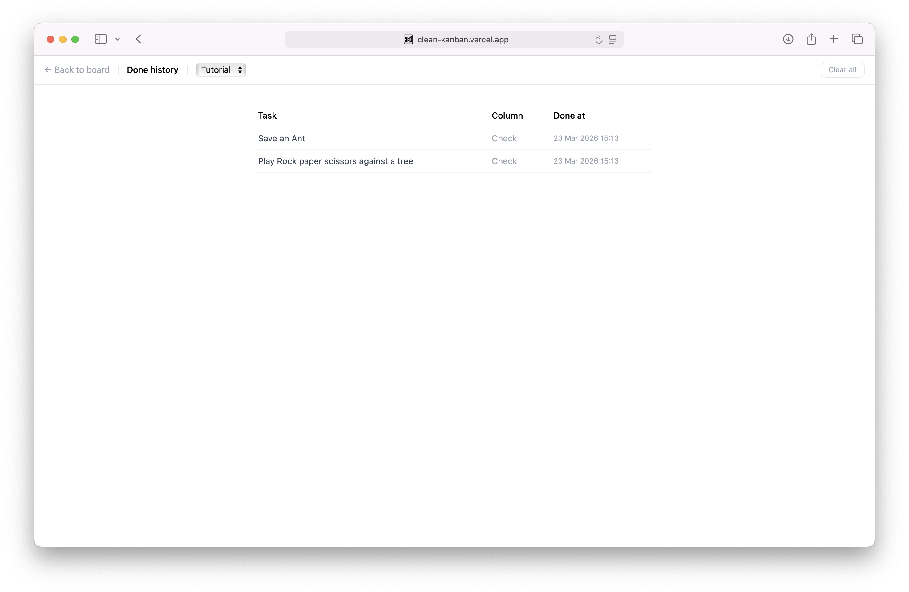

  

  

  A Kanban board that stays out of your way.

---

Most Kanban tools are built for teams of 50, with roadmaps, epics, story points, integrations, automations, and a settings page you'll never touch. They solve problems you don't have.

**CleanKanban is the opposite.**

It's a board. With columns. And cards. You move cards across columns. When something's done, you mark it done. That's it.

No clutter. No onboarding. No cognitive overhead.  
Just you, your team, and the work.

---

## What it does

- **Boards** — create one, share it with a short join code, done
- **Columns** — add them, name them, reorder them
- **Tasks** — add, edit, move between columns, mark as done
- **Done history** — a simple log of everything you've completed
- **Realtime** — every change shows up instantly for everyone on the board, no refresh needed
- **Auth** — sign in with Google, stay signed in

  

### Nice DID history

  

---

## Built for teams but without the overhead

CleanKanban is designed to work with other people, just without the setup friction that usually comes with it.

**Here's how it works:**

1. **Create a board** — sign in, hit "New Board", give it a name.
2. **Share the join code** — every board gets a short, unique code (e.g. `XK39F`). Copy it and send it to your team in a message, a thread, wherever.
3. **Everyone joins instantly** — teammates open CleanKanban, click "Join Board", paste the code, and they're in. No invitations. No email confirmations. No account setup beyond signing in.
4. **Work together in real time** — every card moved, every task added, every column renamed shows up live for everyone on the board. No refreshing. No merge conflicts. Everyone sees the same board, always.

That's the entire collaboration model. One code. Everyone's in. Start working.

---

## Stack

**Next.js 15** · **TypeScript** · **Tailwind CSS** · **Supabase** (Auth + Postgres + Realtime)
